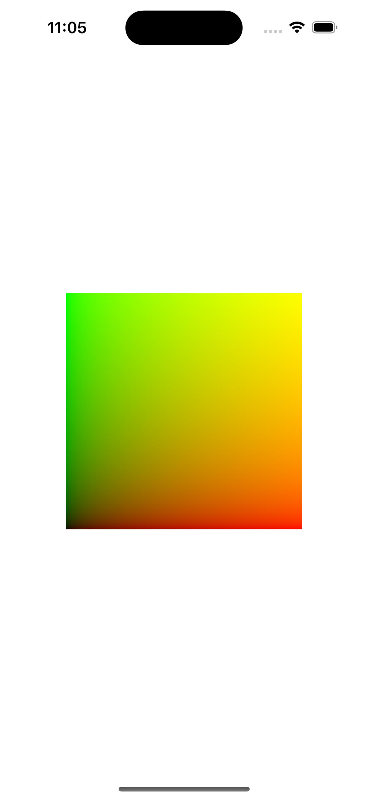

# SceneKit-Vertex

Easily assemble SCNGeometry using Arrays, Data, or MTLBuffers.

## Motivation

I wanted to use macros.

When I wanted to add auxiliary lines for debugging and such, if I kept using SceneKit as it is, the original code would become more complicated. So, I aimed to reduce this complexity and make it possible to write the code more succinctly.

## Features

|Features|
|-|
|Open source library written in Swift 5.9|
|Distribution with Swift Package|
|For rapid prototyping with SceneKit|

## The First Step



``` swift
import SwiftUI
import SceneKit
import SceneKit_Vertex

struct ContentView: View {
    
    @State private var scene = SCNScene()
    @State private var pointOfView = SCNNode()
    
    var body: some View {
        VStack {
            SceneView(scene: scene,
                      pointOfView: pointOfView,
                      options: [
                        .allowsCameraControl,
                        .autoenablesDefaultLighting
                      ])
        }
        .padding()
        .onAppear {
            
            pointOfView.camera = SCNCamera()
            pointOfView.simdPosition = [0,0,5]
            
            scene.rootNode.geometry = SCNGeometry(primitiveType: .polygon) {
                #vertex<SIMD3<Float>>([[-1,-1, 0], [ 1,-1, 0], [ 1, 1, 0], [-1, 1, 0]])
                #color<SIMD3<Float>>([[0,0,0], [1,0,0], [1,1,0], [0,1,0]])
            }
            scene.rootNode.geometry?.firstMaterial?.lightingModel = .constant
        }
    }
}

#Preview {
    ContentView()
}
```

Or,

```swift
import SwiftUI
import SceneKit
import SceneKit_Vertex

@SCNVertex struct Vertex {
    var position: SIMD3<Float>
    var color:    SIMD3<Float>
}

struct ContentView: View {
    
    @State private var scene = SCNScene()
    @State private var pointOfView = SCNNode()
    
    var body: some View {
        VStack {
            SceneView(scene: scene,
                      pointOfView: pointOfView,
                      options: [
                        .allowsCameraControl,
                        .autoenablesDefaultLighting
                      ])
        }
        .padding()
        .onAppear {
            
            pointOfView.camera = SCNCamera()
            pointOfView.simdPosition = [0,0,5]
            
            scene.rootNode.geometry = SCNGeometry(primitiveType: .polygon) {
                #interleave([
                    ([-1,-1,0], [0,0,0]),
                    ([ 1,-1,0], [1,0,0]),
                    ([ 1, 1,0], [1,1,0]),
                    ([-1, 1,0], [0,1,0]),
                ].map(Vertex.init))
            }
            scene.rootNode.geometry?.firstMaterial?.lightingModel = .constant
        }
    }
}

#Preview {
    ContentView()
}
```

## Overview

SceneKit-Vertex addresses the following aspects of geometry generation from custom vertex data:

- Simplification of vertex data handling
- Simplification of vertex index handling

## A Bit More Detail

There are three ways to handle input vertex data:

- Arrays
- Data
- MTLBuffer

Two types of vertex data are considered:

- Separate attributes of vertices
- Interleaved structures of vertex attributes

Vertex attribute names are the same as SCNGeometrySource.Semantic and the following can also be used:

- position (position vectors)

Vertex indices can be omitted when drawing vertex data sequentially from the beginning (note that APIs might differ).

## Going into a Little More Detail

When using it, the following two initializers serve as the foundation, along with macros.
```swift
SCNGeometry.init(primitiveType: GeometryPrimitiveType, @GeometrySourceBuilder _ children: () -> [SCNGeometrySource])
```

```swift
SCNGeometry.init(@GeometryBuilder _ children: () -> (sources: [SCNGeometrySource], elements: [SCNGeometryElement])
```

There are three main types of macros:
- Geometry-related
- Interleaved vertex definition-related
- Interleaved vertex protocol-conformance-related

Here are the macros for geometry-related purposes:

```swift
#interleave
#element
#polygon

#vertex
#normal
#color
#texcoord
#tangent
#vertexCrease
#edgeCrease
#boneWeights
#boneIndices
```

And here are the macros for interleaved vertex definition:

```swift
@SCNVertex
@SCNAttribute
@SCNIgnore
```

For making interleaved vertex conform to protocols, the following macros are used:

```swift
#vertex
#normal
#color
#texcoord
#tangent
#vertexCrease
#edgeCrease
#boneWeights
#boneIndices
```

## How to Use

#### Case.1

When preparing arrays for each attribute individually.

``` Swift
// Generating geometry from an array of position vectors
let geometry0: SCNGeometry = SCNGeometry(primitiveType: .line) {
    [[0,0,0],[1,1,1]] as [SIMD3<Float>]
}

// Generating geometry from position vectors and vertex indices
let geometry1: SCNGeometry = SCNGeometry() {
    #vertex<SIMD3<Float>>([[0,0,0], [1,1,1]])
    #element<UInt32>(primitiveType: .line, [0, 1])
}
```

#### Case.2

When preparing an array of structs that combine attributes.

``` Swift
// Vertex structure combining position and normal vectors
@SCNVertex struct InterleavedVertex {
    var position: SIMD3<Float>
    var normal: SIMD2<Float>
}

// Array of vertices
let vertices: [InterleavedVertex] = [
    .init(position: [0,0,0], normal: [0,0]),
    .init(position: [1,1,1], normal: [1,1])
    ]

// Generating geometry from an array of vertices
let geometry0: SCNGeometry = SCNGeometry(primitiveType: .line) {
    // If primitive type is specified, vertex indices are not included
    // You can directly place the array here
    // Alternatively, you can use #interleave(vertices)
    vertices
}

// Generating geometry from an array of vertices and vertex indices
let geometry1: SCNGeometry = SCNGeometry() {
    // Bulk source specification
    #interleave(vertices)
    // Index specification
    #element<UInt32>(primitiveType: .line, [0,1])
}
```

#### Case.3

When using MTLBuffer.


``` C
// In headers of languages like C, C++, objc, Metal, etc., if defining vertices
typedef struct {
    vector_float3 texcoord;
    vector_ushort3 position;
    vector_float2 nameless;
} MetalVertex;
```

``` Swift
// Apply the protocol for compatibility
extension MetalVertex: MetalInterleave {
    
    static var interleave: [MetalAttribute] = [
        // Standard attributes
        #texcoord,
        // Attributes requiring auxiliary information
        #position(vertexFormat: .half3),
        #normal(keyPath: \Self.nameless, vertexFormat: .float2)
    ]
}

// Vertex buffer. Details omitted
let vertexBuffer: MTLBuffer = ...

// Vertex index buffer. Details omitted
let elementBuffer: MTLBuffer = ...

let geometry1: SCNGeometry = SCNGeometry(primitiveType: .triangles) {
    #interleave<MetalVertex>(buffer: vertexBuffer)
}

let geometry2: SCNGeometry = SCNGeometry {
    #interleave<MetalVertex>(buffer: vertexBuffer)
    #element<Int32>(primitiveType: .line, [0,4,1,3,2])
}

// When defining vertices on the Swift side, you can use macros for additional information and apply protocols.
@MTLVertex struct Vertex_N3FV3H {
    var normal: SIMD3<Float>
    var vertex: SIMD3<Float16>
}

let geometry3: SCNGeometry = SCNGeometry {
    #interleave<Vertex_N3FV3H>(buffer: vertexBuffer)
    #element<Int32>(primitiveType: .line, buffer: vertexBuffer)
}
```

### Case.4

When dealing with a single polygon

``` Swift
let positions: [SCNVector3] = [SCNVector3(0,0,0),SCNVector3(0,1,0),SCNVector3(1,1,0),SCNVector3(1,0,0)]

// Without preparing an element, you can only handle a single polygon
let geometry1 = SCNGeometry(primitiveType: .polygon) {
    #position(positions)
}
```

### Case.5

When dealing with multiple polygons


``` Swift
let positions: [SCNVector3] = [SCNVector3(0,0,0),SCNVector3(0,1,0),SCNVector3(1,1,0),SCNVector3(1,0,0)]
// You can build vertex indices with an array of arrays
let elements: [[UInt32]] = [[0,1,2,3],[3,2,1,0]]

// By preparing an element, you can handle multiple polygons
// In this case, you cannot use Data or MTLBuffer for elements
let geometry1 = SCNGeometry {
    #position(positions)
    #polygon(elements)
}
```

## Why Use Macros

In protocol extension KeyPaths, it wasn't possible to take stride or offset. Macros solve this issue.

## Requirements

- Xcode 15
- macOS 10.15 or newer, iOS 13 or newer, etc...

